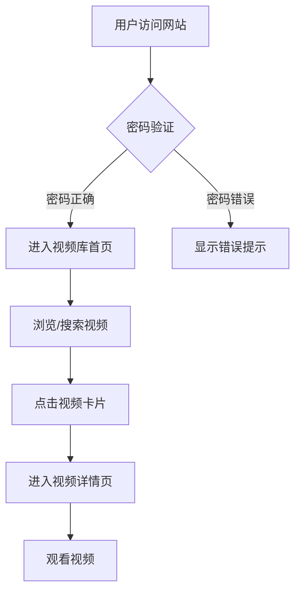
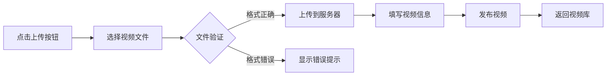

# 影视殿堂 - 产品需求文档

## 1. 产品概述

**影视殿堂**是一款专为影视爱好者设计的私人视频分享平台。用户可通过密码验证后进入网站，上传和管理电影、动漫等视频内容。整体设计融合"赛博朋克美学"与"经典影院氛围"，打造沉浸式的视觉体验。

### 核心目标
- 提供安全、私密的视频分享空间
- 打造极具视觉冲击力的界面体验
- 支持多种视频格式的上传与播放

### 目标用户
- 影视爱好者、动漫粉丝
- 需要私密分享视频的个人或小团体
- 希望拥有独特风格视频库的用户

---

## 2. 核心功能

### 2.1 用户角色
| 角色 | 认证方式 | 核心权限 |
|------|---------|---------|
| 访客 | 密码验证 | 无 |
| 会员 | 密码验证通过 | 上传、浏览、播放视频 |

### 2.2 功能模块
1. **密码验证页** - 入口安保界面
2. **视频库首页** - 视频展示与分类浏览
3. **视频详情页** - 视频播放与信息展示
4. **上传管理页** - 视频上传与管理

### 2.3 页面详情

#### 页面1：密码验证页（入口）
| 模块名称 | 功能描述 |
|---------|---------|
| 密码输入区 | 居中显示的密码输入框，搭配霓虹发光边框 |
| 验证按钮 | 渐变发光按钮，hover时有脉冲动画 |
| 错误反馈 | 输入错误时显示震动动画和错误提示 |
| 背景氛围 | 动态粒子背景 + 电影胶片孔洞装饰 |

#### 页面2：视频库首页
| 模块名称 | 功能描述 |
|---------|---------|
| 顶部导航栏 | Logo、搜索框、用户信息 |
| 分类标签栏 | 电影、动漫、纪录片等分类筛选 |
| 视频卡片网格 | 3列网格布局，每张卡片包含封面、标题、时长、类型标签 |
| 视频卡片交互 | hover时卡片上浮并显示播放按钮预览 |

#### 页面3：视频详情页
| 模块名称 | 功能描述 |
|---------|---------|
| 视频播放器 | 全屏自适应播放器，支持多种格式 |
| 视频信息栏 | 标题、描述、上传时间、播放次数 |
| 相关推荐 | 同类型视频推荐列表 |

#### 页面4：上传管理页
| 模块名称 | 功能描述 |
|---------|---------|
| 文件上传区 | 拖拽上传区域，支持多文件 |
| 上传进度 | 实时显示上传进度条 |
| 视频列表 | 已上传视频的管理（编辑、删除） |

---

## 3. 核心流程

### 3.1 用户访问流程

### 3.2 视频上传流程

---

## 4. 用户界面设计

### 4.1 设计风格：赛博朋克影院 (Cyberpunk Cinema)

#### 色彩方案
| 色彩角色 | 色值 | 用途 |
|---------|------|------|
| 主背景 | #0a0a0f | 深邃太空黑 |
| 次级背景 | #1a1a2e | 卡片、面板背景 |
| 主强调色 | #00f5ff | 霓虹青色，主要交互元素 |
| 次强调色 | #ff00ff | 霓虹品红，重点高亮 |
| 第三强调色 | #7b2cbf | 霓虹紫色，装饰元素 |
| 文字主色 | #ffffff | 主要文字 |
| 文字次色 | #b8b8b8 | 次要说明文字 |
| 成功色 | #00ff88 | 成功状态 |
| 错误色 | #ff3366 | 错误、警告状态 |

#### 字体选择
- **标题字体**: Orbitron (科技感、未来感)
- **正文字体**: Rajdhani (现代、清晰)
- **装饰字体**: Audiowide (特殊强调)

#### 按钮风格
- 霓虹发光边框
- 渐变背景（青色→品红）
- hover时有脉冲光晕效果
- 圆角设计 (border-radius: 8px)

#### 布局风格
- **卡片式布局**: 视频卡片采用玻璃拟态效果
- **网格系统**: 响应式3列网格（桌面）/ 2列（平板）/ 1列（手机）
- **顶部导航**: 固定在顶部，半透明背景
- **留白设计**: 大面积深色背景突出内容

#### 动画效果
- 页面加载：渐入动画 + 微妙上移
- 卡片hover：上浮 + 边框发光增强
- 按钮交互：发光脉冲 + 缩放
- 背景：缓慢漂浮的粒子效果

### 4.2 页面设计详情

#### 密码验证页
- **布局**: 垂直居中，密码输入框 + 按钮
- **色彩**: 主强调色霓虹青色发光
- **字体**: 大号标题 (48px Orbitron)
- **动画**: 背景粒子漂浮 + 输入框发光脉冲

#### 视频库首页
- **布局**: 顶部导航 + 左侧分类 + 中央视频网格
- **卡片样式**:
  - 16:9 视频封面比例
  - 玻璃拟态背景 (backdrop-blur)
  - 霓虹边框 (1px solid rgba(0,245,255,0.3))
  - hover时边框发光增强
- **字体**: 标题 24px，正文 14px
- **动画**: 卡片依次淡入 (stagger animation)

#### 视频详情页
- **布局**: 左侧视频播放器 (70%) + 右侧信息栏 (30%)
- **播放器**: 全屏自适应，深色控制栏
- **信息栏**: 标题、描述、标签、元数据

#### 上传管理页
- **布局**: 拖拽上传区 + 视频列表
- **上传区**: 虚线边框，hover时变为霓虹发光
- **进度条**: 渐变填充 + 发光效果

### 4.3 响应式设计
- **桌面 (>1200px)**: 3列视频网格，完整布局
- **平板 (768-1200px)**: 2列视频网格
- **手机 (<768px)**: 1列视频网格，简化导航

### 4.4 视觉效果细节
- **噪点纹理**: 背景添加微妙的噪点效果增加质感
- **渐变叠加**: 不同区域叠加微妙的色彩渐变
- **光晕效果**: 霓虹元素周围添加柔和光晕
- **边框装饰**: 使用电影胶片孔洞图案作为装饰边框

---

## 5. 技术约束

### 5.1 前端技术
- React 18 + Vite
- Tailwind CSS (自定义配置)
- React Router (路由管理)
- 视频播放器使用原生 HTML5 video

### 5.2 数据管理
- 使用 localStorage 存储密码验证状态
- 视频数据使用 mock data (JSON)
- 视频文件使用本地存储或 URL 链接

### 5.3 密码验证
- 简单密码验证（默认密码: cinema2024）
- 密码错误时显示动画反馈
- 验证通过后保存 session 状态

### 5.4 视频处理
- 支持 MP4, WebM, MOV 等常见格式
- 视频封面自动提取或使用占位图
- 本地上传使用 FileReader API 预览

---

## 6. 项目里程碑

1. **阶段一**: 完成 PRD 和技术文档
2. **阶段二**: 实现密码验证页面
3. **阶段三**: 实现视频库首页
4. **阶段四**: 实现视频详情页
5. **阶段五**: 实现上传管理功能
6. **阶段六**: 响应式优化与动画完善
7. **阶段七**: 测试与部署
