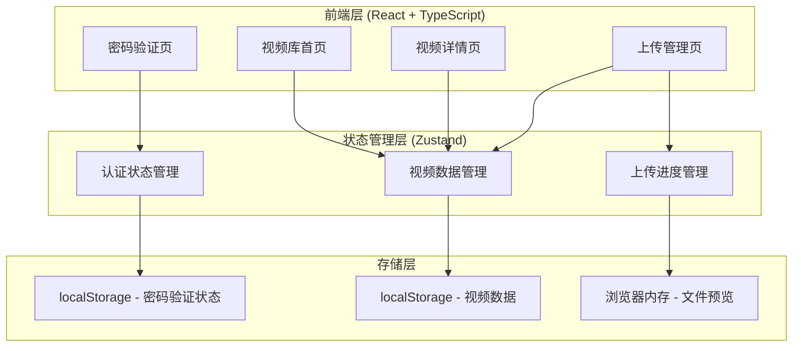

# 影视殿堂 - 技术架构文档

## 1. 架构设计



---

## 2. 技术栈说明

### 前端技术
- **框架**: React 18 + TypeScript
- **构建工具**: Vite
- **样式**: Tailwind CSS (自定义配置)
- **路由**: React Router v6
- **状态管理**: Zustand
- **图标**: Lucide React
- **包管理**: pnpm (优先) / npm

### 项目初始化命令
```bash
pnpm create vite-init@latest . --template react-ts --force
```

---

## 3. 路由定义

| 路由 | 页面名称 | 功能描述 |
|------|---------|---------|
| `/` | LoginPage | 密码验证页面 |
| `/home` | HomePage | 视频库首页 |
| `/video/:id` | VideoPage | 视频详情页 |
| `/upload` | UploadPage | 视频上传管理页 |

### 路由守卫
- 未验证用户访问 `/home`、`/video/:id`、`/upload` 时，重定向到 `/`
- 已验证用户访问 `/` 时，重定向到 `/home`

---

## 4. 状态管理

### 4.1 认证状态 (useAuthStore)
```typescript
interface AuthState {
  isAuthenticated: boolean;
  login: (password: string) => boolean;
  logout: () => void;
}
```

### 4.2 视频数据状态 (useVideoStore)
```typescript
interface Video {
  id: string;
  title: string;
  description: string;
  category: 'movie' | 'anime' | 'documentary';
  duration: string;
  coverUrl: string;
  videoUrl: string;
  uploadTime: string;
  views: number;
}

interface VideoState {
  videos: Video[];
  addVideo: (video: Video) => void;
  deleteVideo: (id: string) => void;
  getVideoById: (id: string) => Video | undefined;
}
```

### 4.3 上传状态 (useUploadStore)
```typescript
interface UploadState {
  isUploading: boolean;
  uploadProgress: number;
  upload: (file: File, info: Partial<Video>) => Promise<void>;
}
```

---

## 5. 数据模型

### 5.1 视频数据模型
```typescript
interface Video {
  id: string;                    // UUID
  title: string;                 // 视频标题
  description: string;           // 视频描述
  category: Category;            // 分类
  duration: string;               // 时长 (格式: HH:MM:SS)
  coverUrl: string;              // 封面图URL
  videoUrl: string;              // 视频文件URL
  uploadTime: string;            // 上传时间 (ISO格式)
  views: number;                // 播放次数
}

type Category = 'movie' | 'anime' | 'documentary';
```

### 5.2 存储键定义
| 存储键 | 数据类型 | 用途 |
|--------|---------|------|
| `cinema_authenticated` | boolean | 认证状态 |
| `cinema_videos` | Video[] | 视频数据 |
| `cinema_password` | string | 访问密码 (默认: cinema2024) |

---

## 6. Mock 数据

项目启动时加载预设的示例视频数据：

```typescript
const mockVideos: Video[] = [
  {
    id: '1',
    title: '星际穿越',
    description: '克里斯托弗·诺兰执导的科幻巨制，讲述一组宇航员穿越虫洞寻找人类新家园的故事。',
    category: 'movie',
    duration: '02:49:00',
    coverUrl: 'https://images.unsplash.com/photo-1534447677768-be436bb09401?w=400&h=225',
    videoUrl: 'https://storage.googleapis.com/gtv-videos-bucket/sample/BigBuckBunny.mp4',
    uploadTime: '2024-01-15T10:30:00Z',
    views: 1234
  },
  {
    id: '2',
    title: '进击的巨人',
    description: '人类与巨人的史诗对决，史诗级的动漫作品。',
    category: 'anime',
    duration: '00:24:00',
    coverUrl: 'https://images.unsplash.com/photo-1607604276583-c77c76ae4e52?w=400&h=225',
    videoUrl: 'https://storage.googleapis.com/gtv-videos-bucket/sample/ElephantsDream.mp4',
    uploadTime: '2024-01-20T14:00:00Z',
    views: 2567
  }
];
```

---

## 7. 组件结构

```
src/
├── components/
│   ├── ui/
│   │   ├── Button.tsx          # 霓虹发光按钮
│   │   ├── Input.tsx           # 发光输入框
│   │   ├── Card.tsx            # 玻璃拟态卡片
│   │   ├── Modal.tsx           # 模态框
│   │   └── VideoPlayer.tsx     # 视频播放器
│   ├── layout/
│   │   ├── Navbar.tsx          # 顶部导航栏
│   │   └── Sidebar.tsx         # 分类侧边栏
│   ├── video/
│   │   ├── VideoCard.tsx       # 视频卡片组件
│   │   ├── VideoGrid.tsx       # 视频网格容器
│   │   ├── VideoList.tsx       # 视频列表
│   │   └── UploadZone.tsx      # 上传区域
│   └── common/
│       ├── ParticleBackground.tsx  # 粒子背景
│       ├── NeonGlow.tsx            # 霓虹发光效果
│       └── CategoryTag.tsx         # 分类标签
├── pages/
│   ├── LoginPage.tsx           # 密码验证页
│   ├── HomePage.tsx            # 视频库首页
│   ├── VideoPage.tsx           # 视频详情页
│   └── UploadPage.tsx          # 上传管理页
├── stores/
│   ├── authStore.ts            # 认证状态
│   ├── videoStore.ts          # 视频数据状态
│   └── uploadStore.ts         # 上传状态
├── hooks/
│   ├── useAuth.ts              # 认证钩子
│   └── useVideos.ts            # 视频数据钩子
├── utils/
│   ├── storage.ts              # 本地存储工具
│   └── formatters.ts          # 格式化工具
├── data/
│   └── mockVideos.ts           # Mock 数据
├── App.tsx                     # 主应用组件
├── main.tsx                    # 入口文件
└── index.css                   # 全局样式
```

---

## 8. Tailwind CSS 自定义配置

```javascript
// tailwind.config.js
module.exports = {
  content: ['./index.html', './src/**/*.{js,ts,jsx,tsx}'],
  theme: {
    extend: {
      colors: {
        cyber: {
          bg: '#0a0a0f',
          card: '#1a1a2e',
          cyan: '#00f5ff',
          magenta: '#ff00ff',
          purple: '#7b2cbf',
          text: '#ffffff',
          'text-muted': '#b8b8b8',
          success: '#00ff88',
          error: '#ff3366',
        }
      },
      fontFamily: {
        orbitron: ['Orbitron', 'sans-serif'],
        rajdhani: ['Rajdhani', 'sans-serif'],
        audiowide: ['Audiowide', 'cursive'],
      },
      boxShadow: {
        'neon-cyan': '0 0 20px rgba(0, 245, 255, 0.5)',
        'neon-magenta': '0 0 20px rgba(255, 0, 255, 0.5)',
        'neon-purple': '0 0 20px rgba(123, 44, 191, 0.5)',
      },
      animation: {
        'pulse-neon': 'pulse-neon 2s ease-in-out infinite',
        'float': 'float 6s ease-in-out infinite',
        'shake': 'shake 0.5s ease-in-out',
      },
      keyframes: {
        'pulse-neon': {
          '0%, 100%': { opacity: '1' },
          '50%': { opacity: '0.5' },
        },
        'float': {
          '0%, 100%': { transform: 'translateY(0px)' },
          '50%': { transform: 'translateY(-20px)' },
        },
        'shake': {
          '0%, 100%': { transform: 'translateX(0)' },
          '25%': { transform: 'translateX(-10px)' },
          '75%': { transform: 'translateX(10px)' },
        },
      },
    },
  },
  plugins: [],
}
```

---

## 9. 页面实现细节

### 9.1 密码验证页 (LoginPage)
- 全屏居中布局
- 动态粒子背景
- 密码输入框带霓虹发光边框
- 错误时震动动画
- 验证成功后跳转到 /home

### 9.2 视频库首页 (HomePage)
- 顶部导航栏（Logo、搜索框）
- 分类标签筛选（全部、电影、动漫、纪录片）
- 响应式视频卡片网格
- 卡片 hover 上浮 + 发光效果

### 9.3 视频详情页 (VideoPage)
- 全宽视频播放器
- 视频信息面板
- 右侧相关推荐列表
- 返回按钮

### 9.4 上传管理页 (UploadPage)
- 拖拽上传区域
- 实时上传进度
- 视频列表管理（预览、删除）
- 表单验证

---

## 10. 部署说明

### 构建命令
```bash
pnpm build
```

### 静态部署
生成的文件位于 `dist/` 目录，可部署到任意静态服务器：
- GitHub Pages
- Vercel
- Netlify
- Nginx

### 访问方式
- 本地访问: `http://localhost:5173`
- 部署后访问: `http://your-domain.com`
- 访问密码: `cinema2024` (可在 localStorage 中修改)

---

## 11. 安全注意事项

1. **密码存储**: 当前使用 localStorage 明文存储，生产环境建议后端验证
2. **文件上传**: 当前为客户端预览，生产环境需要服务端验证
3. **CORS**: 视频资源需配置正确的 CORS 头
4. **文件大小**: 建议限制单文件大小为 500MB
